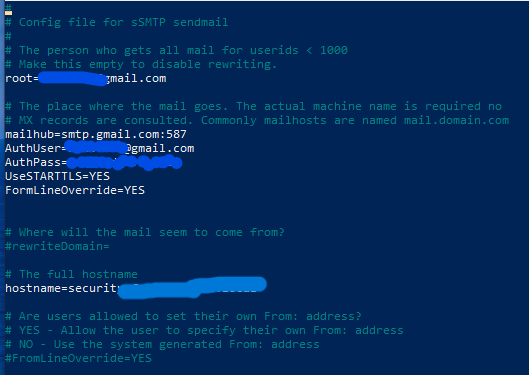

## 🛠️ Prérequis
### 1. Mise à jour du système
```bash
sudo apt update && sudo apt upgrade -y
```
### 2. Installer Nmap
```bash
sudo apt install nmap -y
```
### 3. Installer un client mail (requis pour envoyer les rapports)

Le projet utilise bsd-mailx car il est simple et fonctionne bien avec sSMTP.

```bash
sudo apt install bsd-mailx -y
```
### 4. Installer sSMTP

```bash
sudo apt install ssmtp -y
```

Configurer ensuite **/etc/ssmtp/ssmtp.conf** :
```bash
root=MON_EMAIL
mailhub=smtp.gmail.com:587
AuthUser=MON_EMAIL
AuthPass=MON_MDP
UseSTARTTLS=YES
hostname=debian
```




Tester l’envoi :
```bash
echo "Test email" | mail -s "TEST SSMTP" MON_EMAIL
```