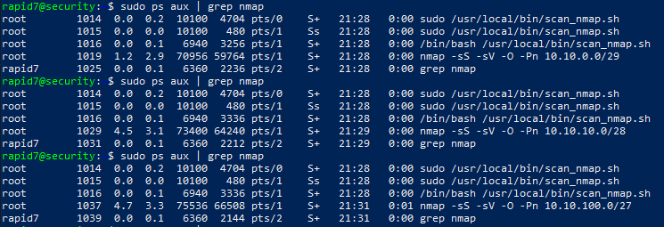
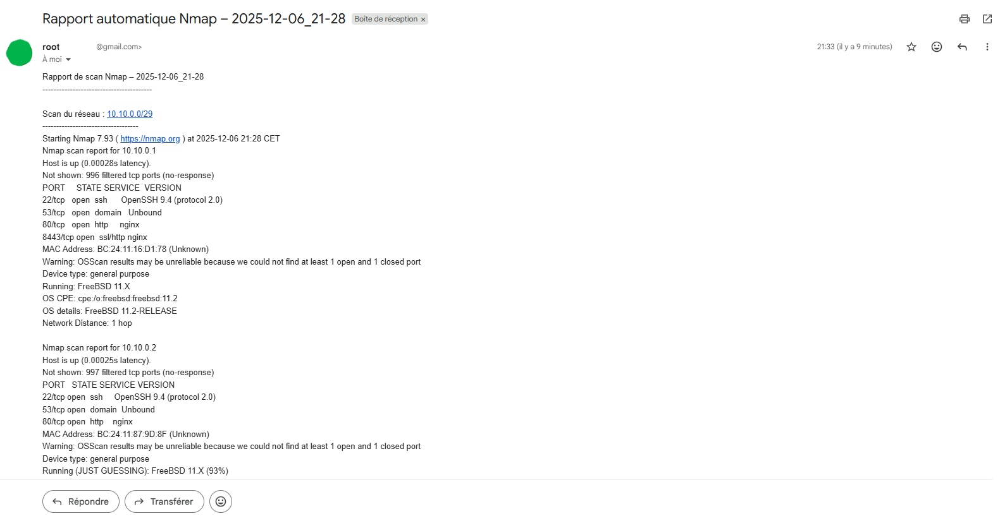

# 🧪 Phase de Recettage

#### Vérifier l'exécution du script

```bash
sudo /usr/local/bin/scan_nmap.sh
```

Vérifier que Nmap travaille
```bash
ps aux | grep nmap
```




Vérifier que le fichier rapport est bien créé
```bash
ls -l /var/log/nmap_scans/
```

#### Vérifier l’envoi du mail
Tu dois recevoir un mail contenant :

`nmap_report_YYYY-MM-DD_HH-MM.txt`

Vérifier les permissions de sécurité

```bash
ls -ld /var/log/nmap_scans
```

Doit donner :

```bash
drwx------ root root /var/log/nmap_scans
```

### 📘 Exemple de sortie Nmap (extrait)

```bash
Nmap scan report for 192.168.10.1
Host is up (0.00079s latency).
Not shown: 993 closed ports
PORT     STATE SERVICE     VERSION
22/tcp   open  ssh         OpenSSH 8.4p1 Debian
80/tcp   open  http        Apache 2.4.52
443/tcp  open  https       nginx 1.18.0
MAC Address: xx:xx:xx:xx:xx:xx

Running : Linux 5.X
OS CPE: cpe:/o:linux:linux_kernel:5
```

Comme le montre le screen ci-dessous, j'ai reçu automatique le rapport que j'ai généré via le script bash et la configuration de Cron. 



