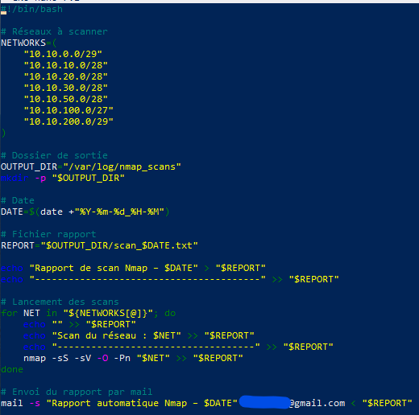
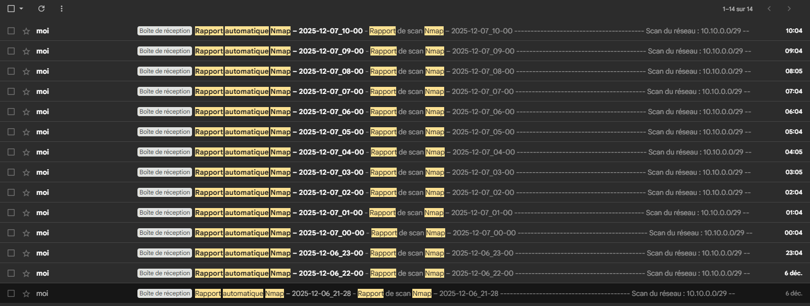

# 🧰 Script complet : scan_nmap.sh

Place ce script dans :
**/usr/local/bin/scan_nmap.sh**

```bash
#!/bin/bash

# ------------------------------
# Script : Scan Nmap Automatisé
# ------------------------------

# Réseaux à scanner
NETWORKS=(
    "192.168.10.0/24"
    "192.168.20.0/24"
    "192.168.30.0/24"
)

# Dossier des logs
LOG_DIR="/var/log/nmap_scans"
mkdir -p "$LOG_DIR"

# Sécurisation des logs
chmod 700 "$LOG_DIR"

# Nom du fichier rapport
DATE=$(date '+%Y-%m-%d_%H-%M')
REPORT="$LOG_DIR/nmap_report_$DATE.txt"

echo "===== Rapport Nmap du $DATE =====" > "$REPORT"

# Boucle de scan
for NET in "${NETWORKS[@]}"; do
    echo "" >> "$REPORT"
    echo "### Scan du réseau : $NET ###" >> "$REPORT"
    nmap -sV -O "$NET" >> "$REPORT"
done

# Envoi du rapport par mail
mail -s "Rapport Nmap - $DATE" MON_EMAIL < "$REPORT"
```



Donner les permissions :
```bash
sudo chmod +x /usr/local/bin/scan_nmap.sh
```

## 📝 Planification automatique avec Cron

### Éditer la crontab :
```bash
sudo crontab -e
```

#### Exemples :  

Fréquence	Tâche  
`Toutes les 4h	0 */4 * * * /usr/local/bin/scan_nmap.sh `  
`Tous les jours à 6h	0 6 * * * /usr/local/bin/scan_nmap.sh`    
`Toutes les semaines	0 7 * * 1 /usr/local/bin/scan_nmap.sh`    

Afin de vérifier que CRON était bien mise en place et fonctionnel, je l'ai configuré de façon à recevoir un mail toutes les heures. 

